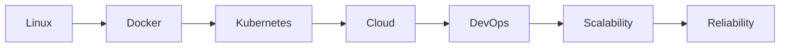

<div align="center">


# 👋 Welcome to my Digital Universe

[](https://git.io/typing-svg)

</div>

---

## 🚀 About Me

```yaml
Name: Mohamed Qamar Eddine Bakhouche
Location: Algeria 🇩🇿
School: Higher School of Computer Science and Digital Technologies (ESTIN)
Field: Computer Science
```

I am a Computer Science student driven by a deep curiosity for technology and innovation.

My interests span across multiple domains of computing, including:

- 💻 Software Development
- 🤖 Artificial Intelligence & Machine Learning
- 🔐 Cybersecurity & Ethical Hacking
- ☁️ Cloud Computing
- 🐧 Linux Systems
- 🏗️ Systems Infrastructure
- 🚢 DevOps & Containerization
- 🌐 Backend Engineering
- 📡 Distributed Systems

I enjoy understanding how modern software systems are designed, secured, deployed, and scaled.

My goal is to become a versatile engineer capable of building intelligent, secure, and highly scalable systems.

---

## 🌌 Current Focus

```text
📚 Studying Computer Science at ESTIN
🧠 Exploring Artificial Intelligence
🔐 Learning Cybersecurity Fundamentals
☁️ Practicing Cloud & Infrastructure Concepts
🐳 Building DevOps Skills with Docker & Kubernetes
🚀 Developing Full Stack Applications
```

---

## 🛠️ Tech Arsenal

### Programming Languages

<p align="center">

</p>

### Frontend Development

<p align="center">

</p>

### Backend Development

<p align="center">

</p>

### Infrastructure & DevOps

<p align="center">

</p>

### AI & Data Science

<p align="center">

</p>

---

## 🔐 Cybersecurity Journey

```text
Network Security
Linux Hardening
Web Security
OWASP Top 10
Ethical Hacking Fundamentals
Digital Forensics
Security Operations
```

---

## 🤖 Artificial Intelligence

Currently exploring:

- Machine Learning
- Deep Learning
- Neural Networks
- Computer Vision
- Natural Language Processing
- Generative AI
- AI Agents

---

## ☁️ Infrastructure & Systems



---

## 📊 GitHub Analytics

<p align="center">


</p>

---

## 🔥 Contribution Streak

<p align="center">


</p>

---

## 🏆 GitHub Trophies

<p align="center">


</p>

---

## 📈 Contribution Graph

<p align="center">


</p>

---

## 🌐 Connect With Me

<p align="center">

<a href="https://linkedin.com/in/mohamed-qamar-eddine-bakhouche-55b4153b7">

</a>

<a href="https://instagram.com/qamro_bkc">

</a>

</p>

---

## 🎯 2026 Goals

- Build advanced full-stack applications
- Master software architecture
- Learn cloud-native technologies
- Strengthen cybersecurity expertise
- Contribute to open-source projects
- Develop AI-powered solutions
- Explore distributed systems and infrastructure

---

<div align="center">

### ⚡ "Building the future one line of code at a time."


</div>


